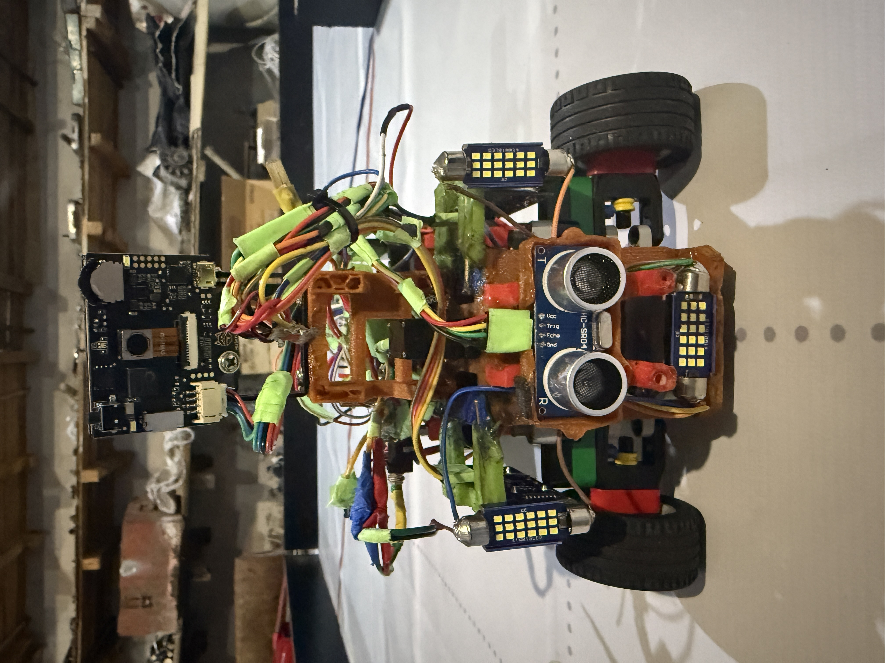
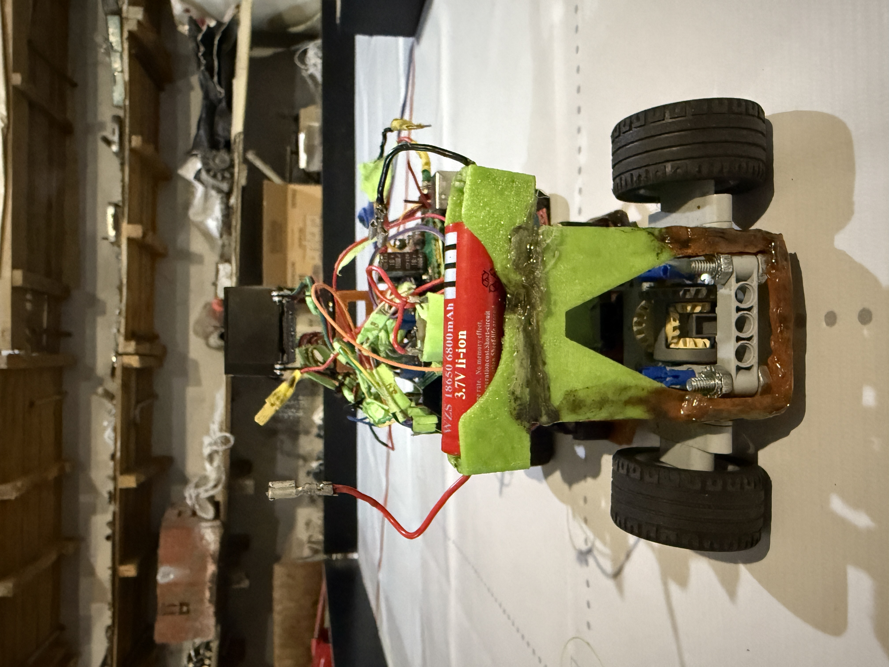

# NEDrobotics – WRO Future Engineers 2025

This repository documents the work of **Team NEDrobotics** for the **World Robot Olympiad (WRO) 2025 Future Engineers** category.  
Our team consists of three members:

- Nicat Vəliyev  
- Elnur Məmmədov  
- Davud Məmmədov 

We designed, built, and programmed an autonomous vehicle capable of competing in the WRO Future Engineers challenges.  
This README explains our hardware, electronics, software modules, and the process to build and upload code to our robot.  
The goal is to make our work **clear, reproducible, and useful for other teams.**

---

## Contents
1. Project Overview  
2. Hardware and Chassis Design  
3. Electronics and Components  
   - Power Management  
   - Sensors and Perception  
   - Actuators and Motors  
4. Wiring and Integration
5. Software and Control Architecture  
   - Arduino Code (Low-Level Control)  
   - Vision and AI Processing  
   - Obstacle and Race Management  
6. Bill of Materials 
7. Photos and Media  
8. Changes and Improvements  
9. Reproducibility and Future Work  

---

## 1. Project Overview
Team NEDrobotics joined the WRO Future Engineers challenge with the goal of creating a reliable and intelligent self-driving robot.  
The competition requires designing a car that can:

- Drive autonomously on a race track  
- Detect and avoid obstacles  
- Handle turns, walls, and markers  
- Demonstrate efficient use of sensors and algorithms  

Our design integrates **Arduino Mega 2560** for control, **HuskyLens Pro camera** for color recognition of traffic signs, **Gyroscope** for maintaining driving direction and **ultrasonic sensors** for distance detection from various targets.  
We combined **3D-printed parts, Lego EV3 motors, and servo-based steering** to create a modular, flexible and upgradable robot.

---

## 2. Hardware and Chassis Design
- **Chassis:** Built with 3D-printed parts for structure and flexibility  
- **Custom 3D Parts:** Hold electronics, motors, and sensors in place  
- **Motors:** Two Lego EV3 medium motors for precise speed and torque control
- **Drive train:** Differential drive and steering system with LEGO Technic parts
- **Steering:** Two SG90 180° servo motors with Lego gears
- **Stability:** Low center of gravity increases balance during turns  

The final build is **strong, lightweight, reliable, and modular**.

---

## 3. Electronics and Components

### 3.1 Power Management
- **2S Li-ion 18650 Battery (7.4V):** Main power source  
- **LM2596 Converters (x4):** 5V for logic, servos, sensors
- **AMS1117 Converter (x1):** 3.3V for gyroscope  

 Provides stable power for each module  

### 3.2 Sensors and Perception
- **HuskyLens Pro AI Camera (x1):** Color recognition  
- **MPU6500 Gyroscope (x1):** Orientation sensing (yaw calculation)  
- **Ultrasonic Sensors (x3):** Distance detection  

### 3.3 Actuators and Motors
- **Lego EV3 Medium Motors (x2):** Drive system  
- **Servo Motors SG90 (x2):** Steering  
- **L298N Motor Driver (x1):** Motor interface with Arduino  

---

## 4. Wiring and Integration
- **Ultrasonic sensors → digital pins**  
- **Gyroscope → I2C**  
- **Motors → L298N with PWM pins**  
- **Servos → dedicated PWM pins**  
- **HuskyLens Pro → Serial/I2C**  

Power distributed via **LM2596 regulators** for stable voltage.

---

## 5. Software and Control Architecture

### 5.1 Arduino Code (Low-Level Control)
- Runs on Arduino Mega  
- Handles motor control, servo steering, ultrasonic readings, gyro feedback  
- Uses PWM and smooth acceleration  

### 5.2 Vision and AI Processing
- Managed by HuskyLens Pro  
- Detects colors of the traffic signs  
- Sends data to Arduino for decisions  

### 5.3 Obstacle and Race Management
- State-machine logic with behaviors:  
  - START  
  - DETERMINE DIRECTION
  - EXIT PARKING LOT
  - REPEAT UNTIL 3 LAPS COMPLETED:
    - DETECT COLOR OF THE TRAFFIC SIGN
    - TURN LEFT AND FOLLOW LEFT WALL / TURN RIGHT AND FOLLOW RIGHT WALL
    - DETECT COLOR OF THE NEXT TRAFFIC SIGN AND MAKE SUITABLE CORNER TURN
  - PARK
  - FINISH  

---

## 6. Bill of Materials

| Amount | Component | Notes |
|--------|-----------|-------|
| 1 | Arduino Mega 2560 | Main controller |
| 4 | LM2596 buck converters | Voltage regulation |
| 1 | MPU6500 gyro | Orientation sensing |
| 1 | AMS1117 | Voltage regulation
| 1 | L298N motor driver | Motor control |
| 2 | Lego EV3 medium motors | Drive |
| 3 | Ultrasonic sensors | Distance measurement |
| 1 | HuskyLens Pro AI camera | Vision |
| 2 | SG90 servo motors (180°) | Steering |
| 2 | Li-ion 18650 Battery | Power source |
| Various | Wires, connectors, 3D-printed parts, Lego chassis | Assembly |

---

## 7. Photos and Media
  

    
  

   

 

---

## 8. Changes and Improvements
During development we made important modifications:  
- Since the color sensor did not work very well and **the values it provided could not be very accurate**, we decided to remove the **TCS3200** from the robot. 
- Although the distance between the robot and the wall was small, the ultrasonic sensors perceived the distance as **far** because they were facing the wall **at an angle** slightly below it. This caused the robot to approach the wall **even closer**, leading to errors. While searching for a practical solution in the robot's driving algorithm, we added various automation algorithms such as the **PID** driving algorithm. Finally, to further improve performance, we decided to place the ultrasonic sensors **on the front of the robot.**
- We made the robot **four-wheel drive** to **minimize the friction force** on the wheels and make it more **stable** and **powerful**. 

---
## 9. Reproducibility and Future Work
We aim to make our robot easy to reproduce.  
This repository includes source code, wiring diagrams, and 3D files.  

Future improvements:  
- Upgrade motors for higher speed  
- Use more advanced **AI camera system**
- Improve overall performance quality
- Use more **precise** sensors

---

## Conclusion
Team NEDrobotics’ project shows how teamwork, electronics, and coding can solve the WRO Future Engineers challenge.  
We created a **reliable, modular, and efficient autonomous robot** with Arduino, HuskyLens, and Lego EV3.  
This repository is a **complete guide** for anyone who wants to understand, rebuild, or improve our design.
