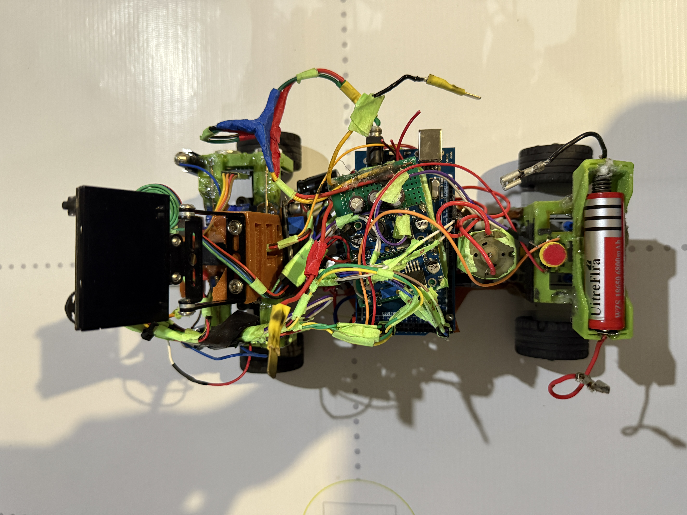
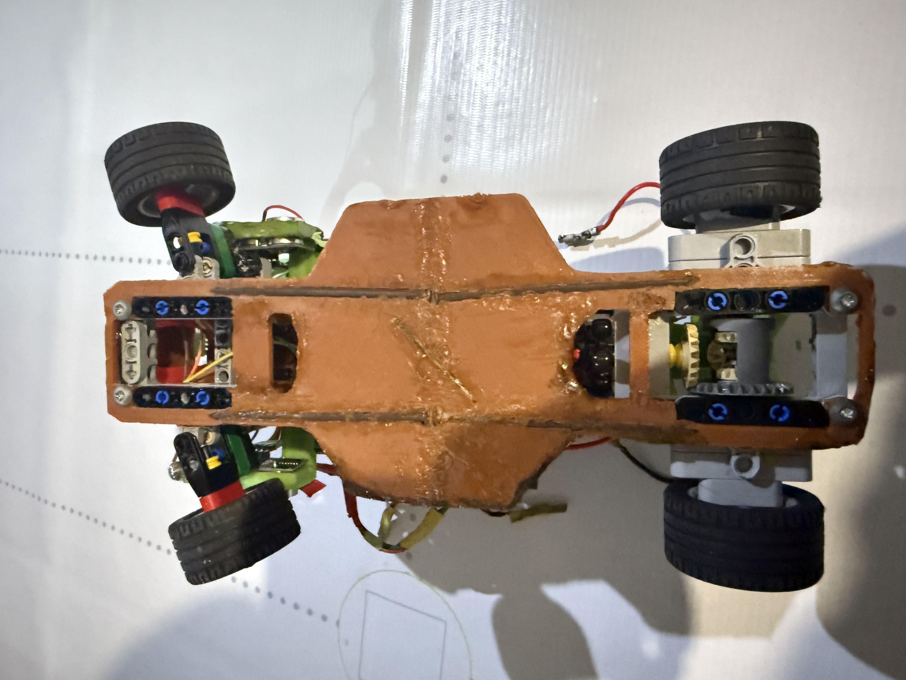

# NEDrobotics – WRO Future Engineers 2025

This repository documents the work of **Team NEDrobotics** for the **World Robot Olympiad (WRO) 2025 Future Engineers** category.  
Our team consists of three members:

- Nicat Vəliyev  
- Elnur Məmmədov  
- Davud Məmmədov 

We designed, built, and programmed an autonomous vehicle capable of competing in the WRO Future Engineers challenges.  
This README explains our hardware, electronics, software modules, and the process to build and upload code to our robot.  
The goal is to make our work **clear, reproducible, and useful for other teams.**

<p> 
  <a href="https://www.labcenter.com" target="_blank">
    
  </a>

  <a href="https://www.arduino.cc/en/software" target="_blank">
    
  </a>

  <a href="https://www.tinkercad.com" target="_blank">
    
  </a>

  <a href="https://www.youtube.com/@NEDRobotics" target="_blank">
    
  </a>
</p>

---

## Contents
1. Project Overview  
2. Hardware and Chassis Design  
3. Electronics and Components  
   - Power Management  
   - Sensors and Perception  
   - Actuators and Motor  
4. Wiring and Integration
5. Software and Control Architecture  
   - Arduino Code (Low-Level Control)  
   - Vision and AI Processing  
   - Obstacle and Race Management  
6. Bill of Materials 
7. Photos and Media  
8. Changes and Improvements  
9. Reproducibility and Future Work  

---

## 1. Project Overview
Team NEDrobotics joined the WRO Future Engineers challenge with the goal of creating a reliable and intelligent self-driving robot.  
The competition requires designing a car that can:

- Drive autonomously on a race track  
- Detect and avoid obstacles  
- Handle turns, walls, and markers  
- Demonstrate efficient use of sensors and algorithms  

Our design integrates **Arduino Mega 2560** for control, **HuskyLens Pro camera** for color recognition of traffic signs, **ultrasonic sensors** for distance detection from various targets.  
We combined **3D-printed parts, 12V DC motor, and servo-based steering** to create a modular, flexible and upgradable robot.

---

## 2. Hardware and Chassis Design
- **Chassis:** Built with 3D-printed parts for structure and flexibility  
- **Custom 3D Parts:** Hold electronics, motor, and sensors in place  
- **Motor:** One 12V DC motor for precise speed and torque control
- **Drive train:** Differential drive and steering system with LEGO parts
- **Steering:** One MG90 180° servo motor with Lego gears
- **Stability:** Low center of gravity increases balance during turns  

The final build is **strong, lightweight, reliable, and modular**.

---

## 3. Electronics and Components

### 3.1 Power Management
- **2S Li-ion 18650 Battery (7.4V):** Main power source  
- **LM2596 Converters (x3):** 5V for logic, servos, sensors
- **XL6009 Step up boost converter (x1):** 12v for motor

 Provides stable power for each module  

### 3.2 Sensors and Perception
- **HuskyLens Pro AI Camera (x1):** Color recognition  
- **Ultrasonic Sensors (x3):** Distance detection  

### 3.3 Actuators and Motors

- **12V DC Motor (x1):** Drive system  
- **Servo Motor MG90 (x1):** Steering  
- **L298N Motor Driver (x1):** Motor interface with Arduino  

---

## 4. Wiring and Integration
- **Ultrasonic sensors → digital pins**  
- **Motor → L298N with PWM pins**  
- **Servo → dedicated PWM pins**  
- **HuskyLens Pro → Serial/I2C** 
###### ↓ Modules added to named regulators ↓
- **Ultrasonic sensors → LM2596 - A** 
- **Servo →  LM2596 - B**
- **HuskyLens Pro → LM2596 - C**  
###### ↑ Modules added to named regulators ↑
Power distributed via **LM2596 regulators** for stable voltage.

---

## 5. Software and Control Architecture

### 5.1 Arduino Code (Low-Level Control)
- Runs on Arduino Mega  
- Handles motor control, servo steering, ultrasonic readings 
- Uses PWM and smooth acceleration  

### 5.2 Vision and AI Processing
- Managed by HuskyLens Pro  
- Detects colors of the traffic signs  
- Sends data to Arduino for decisions  

### 5.3 Obstacle and Race Management
- State-machine logic with behaviors:  
  - START  
  - DETERMINE DIRECTION
  - EXIT PARKING LOT
  - REPEAT UNTIL 3 LAPS COMPLETED:
    - DETECT COLOR OF THE TRAFFIC SIGN
    - TURN LEFT AND FOLLOW LEFT WALL / TURN RIGHT AND FOLLOW RIGHT WALL
    - DETECT COLOR OF THE NEXT TRAFFIC SIGN AND MAKE SUITABLE CORNER TURN
  - PARK
  - FINISH  

### 5.4 The robot's operating logic and code sequence
 - **HuskyLens**
   - The Huskylens camera sends the colors of traffic signs it sees in the distance to the Arduino as raw data and colorID, and the Arduino processes them, enabling the robot to maneuver right or left.
 - **Ultrasonic sensors**
   - The ultrasonic sensors on the right and left sides determine how far away the robot is from the wall and in which direction it should move. During the loop, if the robot is moving clockwise, it uses the data from the right sensor to orient itself; if it is moving counterclockwise, it uses the data from the left sensor. When it's time to turn, if the sensor suddenly detects a very large distance, it starts to turn, stops after turning, checks the distance to the adjacent wall, and then realigns itself to move to the next turning point. *The front sensor only checks the distance to the parking walls during parking time, enabling it to park in an orderly manner.*

 - **Motor driver**
   - The L296N motor driver allows us to control the motor's speed and direction and adjust the brightness of the LEDs.

 - **Button**
   - The button allows us to run the code.

 - **LEDs**
   - The LEDs we placed on the front side assist the huskylens, making the colors of traffic signs appear more *vivid* and easier to see.

 - **Conventors and capacitors**
   - The LM2596 regulators reduce the voltage of the power coming from the battery and send it to the sensors/husklens and other components. *The capacitors supply the sudden current surge.*
### 5.5 Pseudo code
<details> <summary>Click to see!</summary>

```text

# --- Constants / Globals ---
DEFINE pins, servo mids, motor pins, button pin
DEFINE targetdistance, Kp, Ki, Kd, I_MAX, I_MIN
DEFINE alpha, servoUpdateInterval, MAX_CORRECTION_DEG
DEFINE TURN_DEGREE, TURN_PWM, TURN_SETTLE_MS, TURN_TIMEOUT_MS
DEFINE SIDE_TURN_STOP_CM, DELTA_TO_TRIGGER, IGNORE_AFTER_TURN_MS
DEFINE BASE_SPEED, MIN_SPEED, SMALL_STEER_DEG
DEFINE TURN_SIDE_MODE (0=auto,1=left,2=right)

GLOBAL filteredLeft, filteredRight, filteredFront
GLOBAL oldLeft, oldRight, baselineLeft, baselineRight
GLOBAL integralTerm, lastError, lastPidTime
GLOBAL lastServoUpdate, lastS1pos, lastS2pos
GLOBAL ignoreUntil, turnCount, firstTurnDone, activeTurnMode

# --- Low-level helpers ---
FUNCTION readUltrasonicCm(trig, echo):
  pulse trigger, measure echo with timeout
  IF timeout return -1
  RETURN distance_cm

FUNCTION preciseSampleUltrasonics(samples=8, delayMs=20):
  read sensors multiple times, average valid readings
  assign to filteredLeft, filteredRight, filteredFront

FUNCTION stopMotors():
  set motor PWMs = 0

FUNCTION setMotorsForward(forward, speed):
  set motor driver pins and PWM for both motors (account wiring)

# --- Steering helpers ---
FUNCTION setSteerLeftMax(): write servos to s1mid+TURN_DEGREE, s2mid-TURN_DEGREE, update timestamp
FUNCTION setSteerRightMax(): write servos to s1mid-TURN_DEGREE, s2mid+TURN_DEGREE, update timestamp
FUNCTION centerSteering(): write servos to mids, update timestamp

FUNCTION rotateUntilSideUnder(side, stopCm=SIDE_TURN_STOP_CM, timeoutMs=TURN_TIMEOUT_MS):
  turnCount += 1
  steer fully to side, start motors (low then TURN_PWM)
  loop until filtered side < stopCm or timeout:
    read that side, EMA-update filtered value
  stopMotors(), delay(TURN_SETTLE_MS), centerSteering()
  preciseSampleUltrasonics()
  ignoreUntil = now + IGNORE_AFTER_TURN_MS

# --- PID ---
FUNCTION computePidOutput(measured):
  dt = max(epsilon, (now - lastPidTime)/1000)
  error = targetdistance - measured
  integralTerm = clamp(integralTerm + error*dt, I_MIN, I_MAX)
  derivative = (error - lastError)/dt
  output = Kp*error + Ki*integralTerm + Kd*derivative
  output = clamp(output, -MAX_CORRECTION_DEG, MAX_CORRECTION_DEG)
  lastError = error; lastPidTime = now
  RETURN output

FUNCTION writeServosFromOutput(output):
  rate-limit by servoUpdateInterval
  s1pos = constrain(s1mid - output,0,180)
  s2pos = constrain(s2mid + output,0,180)
  write servos, update last positions and timestamp

# --- Setup / Main loop ---
FUNCTION setup():
  Serial begin, configure pins and servos, write mids
  lastPidTime = now; lastServoUpdate = now

LOOP main:
  IF button pressed -> call testProgram()
  ELSE delay(20)

# --- Test routine (compact) ---
FUNCTION testProgram():
  WHILE turnCount < 12:
    drive forward (high speed)
    read sensors once, EMA update filtered values
    IF filteredFront < 50:
      turnCount++
      IF first-time-flag:
        preciseSampleUltrasonics(6)
        choose activeTurnMode by checking filteredLeft (if >80 then left else right)
      pulse big servo deflection toward activeTurnMode for ~800ms, return to center
    small nudge: if activeTurnMode==left and filteredRight<20 -> tiny left nudge; analogous for right
  stopMotors()

# --- Main autonomous routine (compact) ---
FUNCTION runProgram():
  delay(500); ignoreUntil=0; turnCount=0; firstTurnDone=false
  preciseSampleUltrasonics(10); baselineLeft=filteredLeft; baselineRight=filteredRight
  oldLeft = baselineLeft; oldRight = baselineRight

  determine startInMiddle if both filtered sides > 35 cm
  IF TURN_SIDE_MODE forced -> set activeTurnMode accordingly
  ELSE IF startInMiddle -> activeTurnMode = 0 (unlocked)
  ELSE activeTurnMode = side with smaller initial distance

  WHILE turnCount < 11:
    read sensors once, EMA update filteredLeft/Right/Front
    turned = false

    # 1) Auto-first-turn detection (only if AUTO mode & not done)
    IF not firstTurnDone AND TURN_SIDE_MODE==0 AND now > ignoreUntil:
      leftDelta = filteredLeft - oldLeft
      rightDelta = filteredRight - oldRight
      IF max(leftDelta, rightDelta) >= DELTA_TO_TRIGGER:
        chosenSide = side with larger delta
        preciseSampleUltrasonics(6)
        IF (filteredChosen - oldChosen) >= DELTA_TO_TRIGGER:
          activeTurnMode = chosenSide
          firstTurnDone = true
          perform simple timed servo turn toward chosenSide (short motor pulse + servo deflection)
          reset PID (integralTerm, lastError, lastPidTime)
          turned = true
          stopMotors()
          preciseSampleUltrasonics(6)

    # 2) Side-specific trigger (locked mode)
    IF not turned AND now > ignoreUntil:
      IF activeTurnMode == LEFT AND filteredLeft - oldLeft >= DELTA_TO_TRIGGER:
        preciseSampleUltrasonics(6)
        IF still triggered: rotateUntilSideUnder(LEFT); reset PID; firstTurnDone=true; turned=true
      ELSE IF activeTurnMode == RIGHT AND filteredRight - oldRight >= DELTA_TO_TRIGGER:
        analogous for RIGHT

    # 3) Normal wall-following if not turning
    IF not turned:
      beforeFirstTurn = (not firstTurnDone AND TURN_SIDE_MODE==0)
      IF beforeFirstTurn AND filteredLeft>35 AND filteredRight>35:
        centerSteering(); setMotorsForward(true, moderate_speed)
      ELSE:
        measured = (activeTurnMode==RIGHT) ? filteredRight : filteredLeft
        pidOutput = computePidOutput(measured)
        IF beforeFirstTurn: clamp pidOutput to SMALL_STEER_DEG
        servoOutput = pidOutput * (activeTurnMode==RIGHT ? -1 : 1)
        writeServosFromOutput(servoOutput)
        compute speed reduction based on |pidOutput| and setMotorsForward(true, speed)

    oldLeft = filteredLeft; oldRight = filteredRight
    delay(20)

  # finish sequence
  driveForwardStraight(120)
  apply small final servo offset then stopMotors()

# --- End of pseudocode

```

</details>


## 6. Bill of Materials

| Amount | Component | Notes | Prices |
|--------|-----------|-------|--------|
| 1 | [Arduino Mega 2560](other/arduinomega.jpg) | Main controller | 18.2₼ (10.7$) |
| 4 | [LM2596 buck converters](other/lm2596.jpg) | Voltage regulation | 2.6₼ (1.52$) |
| 1 | [L298N motor driver](other/l296n.jpg) | Motor control | 3.5₼ (2.05$) |
| 1 | [12V DC Motor](other/dc.jpg) | Drive | Free |
| 3 | [Ultrasonic sensors](other/ultrasonic.jpg) | Distance measurement | 8₼ (4.7$) |
| 1 | [HuskyLens Pro AI camera](other/huskylens.jpg) | Vision | Free |
| 1 | [MG90 servo motor (180°)](other/mg90.jpg) | Steering | 4.5₼ (2.64$) |
| 4 | [Li-ion 18650 Battery](other/li-ion.jpg) | Power source | 19₼ (11.17$) |
| 1 | [2S Li-Po Tattu 500mAh](other/li-po.jpg) | Power source | Free |
| 1 | [2x18650 Battery Holder](other/holder.jpg) | Misc | 4.3₼ (2.52$) |
| 1 | [Lithium Batter charger](other/charger.jpg) | Misc | 13.9₼ (8.17$) |
| 3 | [LEDs](other/light.jpg) | Misc | Free |
| 1 | [16v 4700µ Capacitor](other/16v.jpg) | Misc | 3₼ (1.76$) |
| 2 | [25v 4700µ Capacitors](other/25v.jpg) | Misc | 3.5₼ (2.05$) |
| Various | Wires, connectors, 3D-printed parts, Lego chassis | Assembly | Free |

## **Total:** --- **84₼ (49.4$)**

##### We paid 70₼ (41.1$) for the map, and we already had the boards for the walls, which we painted with black spray paint.
###### Items marked with “Free*” are parts that we had in previous races.

---

## 7. Photos and Media
### The robot's mission rounds *( /videos )*
<p> 
  <a href="https://youtube.com/shorts/DDyiXAjG3tE?feature=share" target="_blank">
    
  </a>

  <a href="---" target="_blank">
    
  </a>
</p>

### Photos of the robot *( /v-photos )*

  

    
  

   

### The robot's electronic schematic  *( /schemes )*
 

### Photos of the team *( /t-photos )*
 
 

---

## 8. Changes and Improvements
During development we made important modifications:  
- Since the color sensor did not work very well and **the values it provided could not be very accurate**, we decided to remove the **TCS3200** from the robot. 
- Although the distance between the robot and the wall was small, the ultrasonic sensors perceived the distance as **far** because they were facing the wall **at an angle** slightly below it. This caused the robot to approach the wall **even closer**, leading to errors. While searching for a practical solution in the robot's driving algorithm, we added various automation algorithms such as the **PID** driving algorithm. Finally, to further improve performance, we decided to place the ultrasonic sensors **on the front of the robot.**
- We updated our HuskyLens camera with *HUSKYLENSWithModelV0.5.1bNorm* so it can better distinguish object colors and operate with fewer errors. The newer version slightly improved color recognition performance on the robot.
- We made the robot **rear-wheel drive** to **minimize the friction force** on the wheels and make it more **stable** and **powerful**. 
- Previously, there were no LEDs in front of the robot. Later, through experience, we realized that **it couldn't fully identify the colors of traffic signs**, so we placed three powerful **LEDs** on the front.
- Initially, we used **a single power source for the entire system**, but this later caused a number of problems. The reason for this was that the motor drew a sudden surge of current during startup, causing **voltage sag**. As a result, the Arduino and other modules would shut down and restart. As a solution, we **separated the power sources** for the motors (drive and servo motors). We also added **three capacitors** to handle the current demand **at peak times.** 
---
## 9. Reproducibility and Future Work
We aim to make our robot easy to reproduce.  
This repository includes source code, wiring diagrams, and 3D files.  

Future improvements:  
- Upgrade motor for higher speed  
- Use more advanced **AI camera system**
- Improve overall performance quality
- Use more **precise** sensors
- **Shortening** the robot's sizes 
- Use more **powerful** and more **efficient** batteries
---
## 10. Technical specifications
 - **Dimensions:** 275mm (L) x 160mm (W) x 200mm (H)
 - **Weight:** 727g
 - **Maximum speed:** 0.5m/s
 - **Driving system:** Rear-wheel drive (RWD)
 - **Steering Torque:** 20.6Ncm

---
## Conclusion
Team NEDrobotics’ project shows how teamwork, electronics, and coding can solve the WRO Future Engineers challenge.  
We created a **reliable, modular, and efficient autonomous robot** with Arduino, HuskyLens, and Lego EV3.  
This repository is a **complete guide** for anyone who wants to understand, rebuild, or improve our design.
